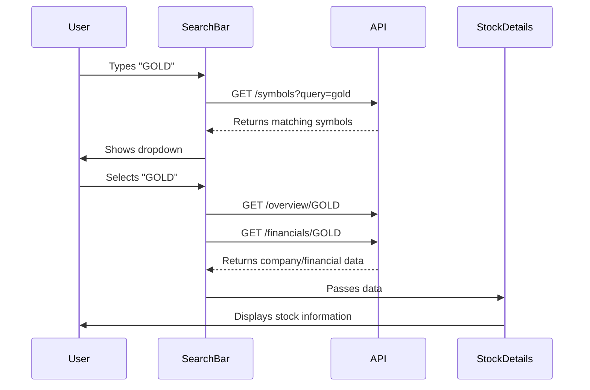

# Frontend Integration Plan

## 1. Search Component Flow


## 2. Required Frontend Changes

### A. SearchBar Component (`frontend/src/components/SearchBar.jsx`)
- Add selection handler to trigger API calls
- Implement state management for selected stock
- Add loading states during API calls

### B. New StockDetails Component (`frontend/src/components/StockDetails.jsx`)
```jsx
function StockDetails({ overview, financials }) {
  return (
    <div className="stock-details">
      <h2>{overview.Name} ({overview.Symbol})</h2>
      <p>Sector: {overview.Sector}</p>
      <p>Industry: {overview.Industry}</p>
      <p>Latest Price: ${financials.latestPrice}</p>
      {/* Add more data fields as needed */}
    </div>
  )
}
```

### C. API Service Updates (`frontend/src/services/api.js`)
```js
// Add new API methods
export const getOverview = (symbol) => 
  api.get(`/overview/${symbol}`);

export const getFinancials = (symbol) => 
  api.get(`/financials/${symbol}`);
```

## 3. Implementation Steps

1. **Modify SearchBar selection handler**:
```jsx
const handleSelect = (symbol) => {
  setLoading(true);
  
  Promise.all([
    getOverview(symbol),
    getFinancials(symbol)
  ]).then(([overviewRes, financialsRes]) => {
    setSelectedStock({
      overview: overviewRes.data,
      financials: financialsRes.data
    });
  }).finally(() => setLoading(false));
}
```

2. **Add rendering logic in main component**:
```jsx
function Dashboard() {
  const [selectedStock, setSelectedStock] = useState(null);

  return (
    <div>
      <SearchBar onSelect={setSelectedStock} />
      {selectedStock && (
        <StockDetails 
          overview={selectedStock.overview}
          financials={selectedStock.financials} 
        />
      )}
    </div>
  )
}
```

## 4. Error Handling Considerations
- Add error states for failed API requests
- Implement retry mechanisms
- Display user-friendly error messages

## 5. Performance Optimizations
- Cache API responses locally
- Debounce search input
- Implement loading skeletons