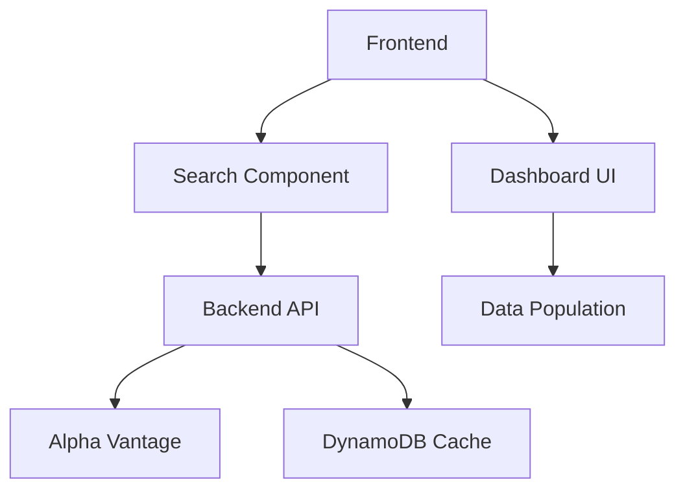

# Stock Search & Dashboard Integration Architecture

## 1. Problem Statement
Enable users to search/select stocks via a functional search bar with dropdown. Upon selection, the system must:
- Trigger backend API call for company overview data
- Remove unsupported UI elements
- Populate dashboard with validated data
- Implement graceful error handling

## 2. System Architecture


## 3. Implementation Phases

### Phase 1: Search Component Enhancement
- **Modify SearchBar.jsx**:
  - Implement dropdown with search results
  - Add selection handler to trigger API call
  - Display loading state during requests
- **Enhance search API** in [`backend/src/data_api/app.py`](backend/src/data_api/app.py:35) to return:
  ```json
  [{"symbol": "AAPL", "name": "Apple Inc.", "exchange": "NASDAQ"}]
  ```

### Phase 2: Backend API Modification
- **Update /overview endpoint** in [`backend/src/data_api/app.py`](backend/src/data_api/app.py:269) to return:
  ```python
  {
    "description": "Company description",
    "sector": "Technology",
    "industry": "Consumer Electronics",
    "market_cap": "2840000000000",
    "pe_ratio": 29.53,
    "dividend_yield": 0.0055,
    "52_week_high": 198.11,
    "52_week_low": 124.17
  }
  ```
- **Field Mapping**:
  | Frontend Field | Alpha Vantage Field | Transformation |
  |----------------|---------------------|----------------|
  | description | Description | Direct mapping |
  | sector | Sector | Direct mapping |
  | industry | Industry | Direct mapping |
  | market_cap | MarketCapitalization | Convert to abbreviated string (1.2T) |
  | pe_ratio | PERatio | Convert to float |
  | dividend_yield | DividendYield | Convert to percentage |
  | 52_week_high | 52WeekHigh | Convert to float |
  | 52_week_low | 52WeekLow | Convert to float |

### Phase 3: Frontend UI Updates
- **Remove unsupported components** from [`Dashboard.jsx`](frontend/src/components/Dashboard.jsx):
  - MiningMetrics component (line 69)
  - NewsFeed component (line 74)
  - Value Analysis section (lines 138-161)
- **Implement data population**:
  ```javascript
  // Dashboard.jsx
  useEffect(() => {
    const fetchData = async () => {
      try {
        const overview = await getCompanyOverview(selectedSymbol);
        setStockData(prev => ({ ...prev, overview }));
      } catch (error) {
        setError('Failed to load company data');
      }
    };
    
    if (selectedSymbol) fetchData();
  }, [selectedSymbol]);
  ```

### Phase 4: Error Handling
- **API service enhancements** in [`api.js`](frontend/src/services/api.js):
  ```javascript
  export const getCompanyOverview = async (symbol) => {
    try {
      const response = await api.get(`/overview/${symbol}`);
      return response.data;
    } catch (error) {
      throw new Error(`Company data unavailable for ${symbol}`);
    }
  };
  ```
- **UI error states**:
  - Display error banner when data fetch fails
  - Implement retry button for failed requests

### Phase 5: Documentation
- Update field mapping table in [`docs/frontend_integration.md`](docs/frontend_integration.md)
- Document error handling protocols

## 4. Timeline & Ownership
| Phase | Estimated Time | Owner |
|-------|----------------|-------|
| Search Enhancement | 1.5 hours | Frontend |
| Backend API Update | 2 hours | Backend |
| UI Cleanup | 1 hour | Frontend |
| Error Handling | 1 hour | Full Stack |
| Documentation | 0.5 hours | Tech Lead |

## 5. Risk Mitigation
- **Data Mismatch**: Validate API responses with Postman
- **Component Removal**: Create feature branch before modifying UI
- **Performance**: Implement client-side caching of API responses
- **Error Handling**: Add Sentry monitoring for API failures